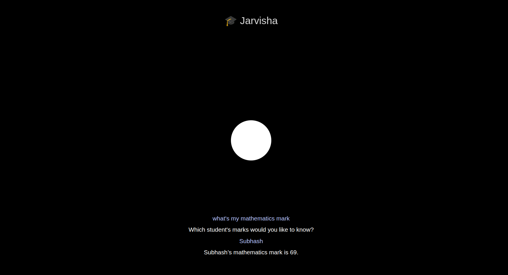

# Jarvisha — College AI Assistant (Offline)

Jarvisha is an AI assistant made to answer basic college-related stuff — like “what's my mark?”, “how do I get better at this subject?”, or “which faculty should I meet?”. It works completely offline. No cloud, no spying, and no internet needed.

---

## What it Does

- Answer basic college-related queries
- Say stuff back to you (text + voice)
- Can work without any internet
- Doesn’t depend on any cloud APIs
- Works on laptop/PC (UI + mic input)
- Can remember things (still improving)

---

## Screenshot




## Current Capabilities

- Runs **Gemma 3B:1** (can be swapped)
- Takes input by voice or typing
- Gives responses in voice and text
- Flask handles backend
- React handles frontend
- Uses Coqui TTS for speech output
- Basic context handling (early stage)
- Not connected to real student DB yet (manual/demo data used)

---

## Why i Made It

Most AI tools need internet and expose data to 3rd parties. Jarvisha doesn’t. It’s like your own college assistant bot that runs completely offline — useful for labs, restricted networks, or just full privacy.

Plus, i wanted to explore how open-source models like **Gemma** + **Coqui** can be stitched together into something useful beyond just chatting.

---

## How to Run

### 1. Clone the project

```bash
git clone https://github.com/yourusername/jarvisha
cd jarvisha
cd backend
python3 -m venv venv
source venv/bin/activate
pip install -r requirements.txt
npm install #cd frontend and run this command
python assistant.py #run it ad root of the folder
```


Tech Stack 

    React (frontend)

    Flask (API backend)

    Gemma 3B:1 (can change model)

    Coqui TTS

    LocalStorage/JSON (for now)

    No DB or vector store yet

Future Add-ons (if i had more time)

    Real-time student marks from college DB

    Faculty database integration

    Wake-word support ("Hey Jarvisha")

    Proper chat history/memory system

    Desktop app or system tray widget

Thats it.
